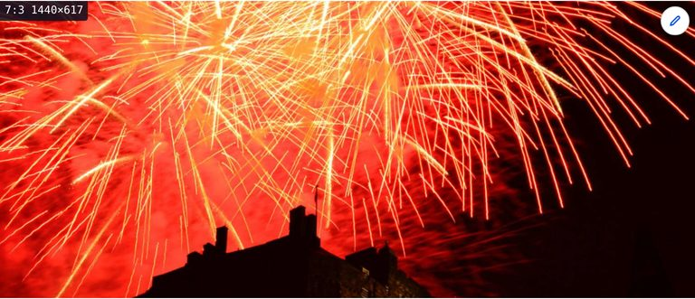
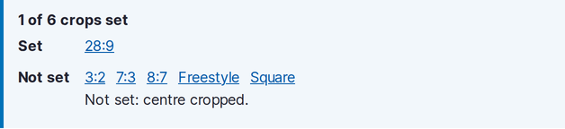
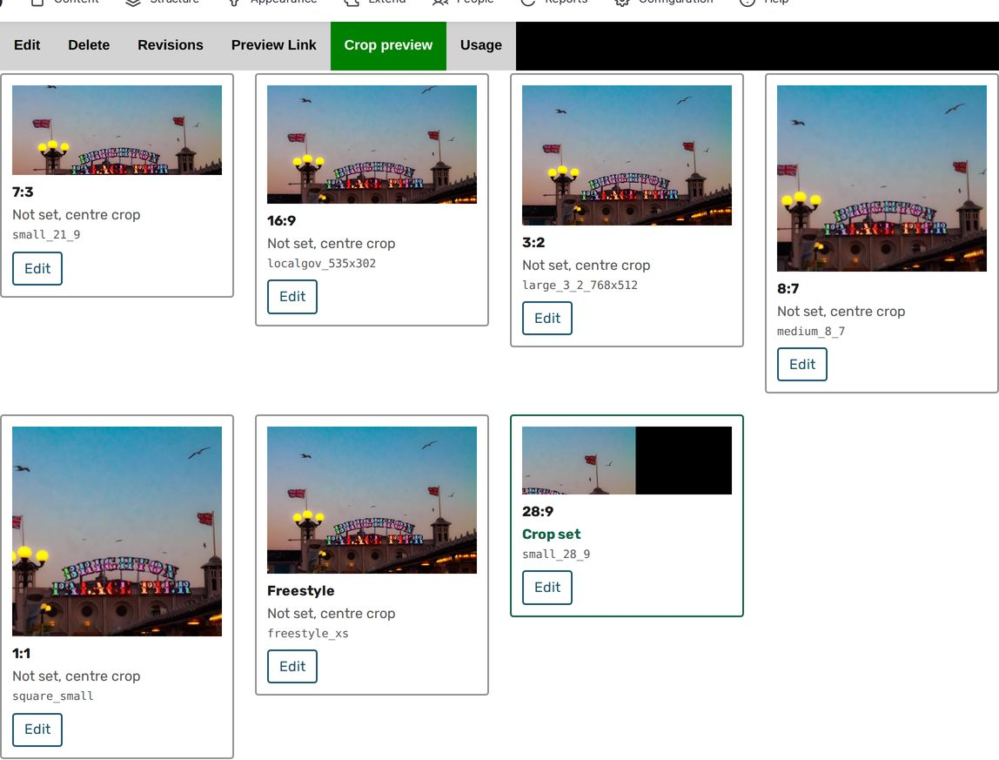

# Labels, summary and crop preview

`media_assist_crop` has three parts. All of them work from the image styles a
site uses: a style is in use when a responsive image style maps it or a field
formatter on any view display renders with it. Styles nothing uses, and the
crop types only they use, are left out.

## Labels

Every image rendered through the image or responsive image formatter with a
cropping style gets a badge naming the shape and the box the browser chose:
the ratio, then the width and height of the style that was served.

The badge is read from the image's `currentSrc`, so on a responsive image it
names the candidate the browser picked. A button at the bottom right of the
page hides and shows the badges; the choice is kept in the browser. Badges
do not print.

Needs the permission *See which image style rendered an image*.

## The summary on the media form

Above the Image Widget Crop widget on an image media form, a live count of
the crops that are set, with the rest listed as not set.

The crop types listed are the ones the widget offers that an image style in
use crops with. Each name is a button that opens that crop's tab. The lists
move as crops are applied and removed in the widget, before the form is
saved.

The Focal Point widget gets no summary: it has one point to set.

Needs the permission *See which crops are set on a media image*.

## The Crop preview tab

Each image media item gets a Crop preview tab beside Edit, showing the
derivative every shape produces from the file as it stands, unset shapes
first.

One tile per shape: each crop type in use, and under a crop type with no
aspect ratio, each ratio its styles produce. The image style shown for a
shape is the one in use nearest 320 pixels wide. The heading counts crop
types, so with Focal Point it reads "0 of 1" or "1 of 1" however many tiles
there are.

A tile's Edit link opens the media form with that crop's tab selected and a
notice naming it, when the form has the Image Widget Crop widget.

The tab needs the permission *See which crops are set on a media image* and
permission to edit the media item.

## What an unset crop shows

A shape with no crop stored renders the way the site renders it: the
`crop_crop` effect passes the image through and the size effect after it
crops from the centre, and a Focal Point effect crops around the default
focal point in its settings, which is the centre unless changed.

## Keeping pages current

Saving, changing or deleting a crop flushes the derivatives of the styles
that crop type is used by, for that file, and invalidates the cache tags of
the file and of every media item using it.
