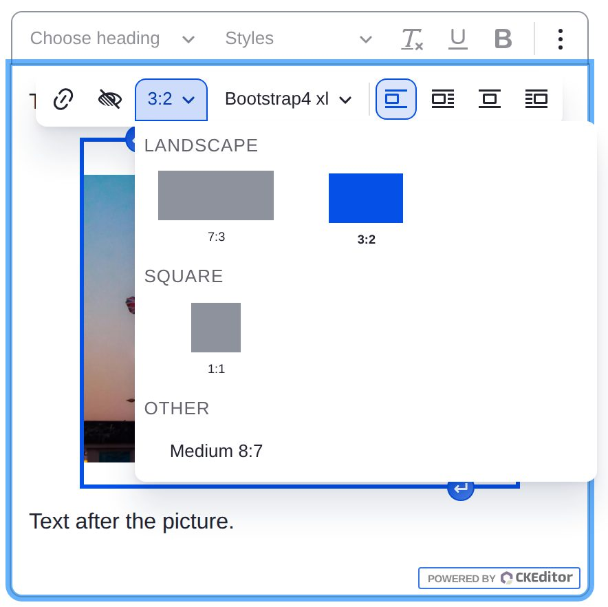
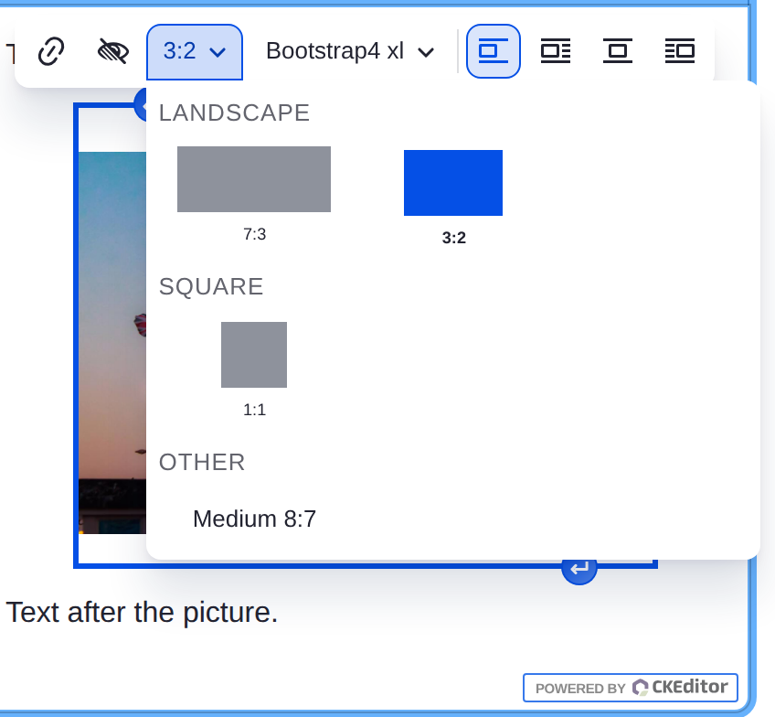
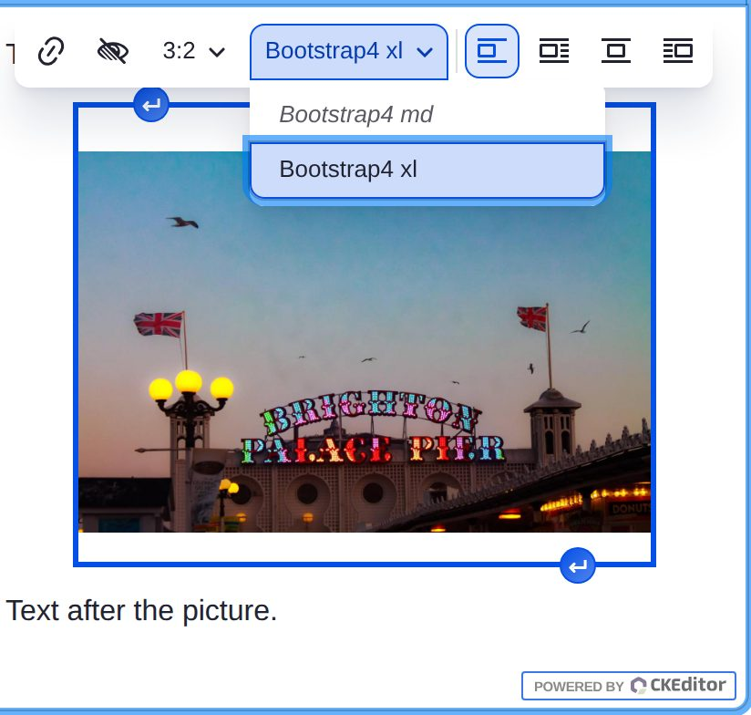

# Shape and size in CKEditor

`media_assist_embed` replaces the view mode list in the media balloon with a
Shape control and a Size control. Behind them the view modes are unchanged:
a choice of shape and size selects one of the view modes the text format
allows, and the content stores `data-view-mode` as it always did.

## Shape

The shapes are drawn to scale, grouped as landscape, square, portrait and no
fixed shape, widest first within each group. The current shape is marked and
the button shows its ratio.

Picking a shape keeps the current size where the shape has a view mode at
that size. Otherwise it takes the text format's default view mode if the
shape has it, or the shape's smallest.

Where a view mode has a shape but no size, or no image at all, it is listed
under Other by its name.

A shape is greyed out when none of its view modes has a display for the
selected media item's type.

## Size

The sizes are the site's breakpoint labels, narrowest first, with one more
past the widest breakpoint where the widest breakpoint has a multiplier
above 1x.

Picking a size keeps the current shape. A size the current shape has no view
mode for is shown in italics; picking it selects the shape's view mode
nearest that size.

## Where the shapes and sizes come from

Every view mode the text format's Media Embed filter allows is looked up on
the view display of each media type. The display's formatter for the media
source field gives the box:

- an image formatter gives the width, height and ratio its image style
  produces, as [How image styles are read](image-style-reader.md) describes;
- a responsive image formatter gives the largest width named in pixels in
  its `sizes` mappings, or the widest mapped style when none is, and the
  height and ratio of the first mapped style that sets a height.

Where more than one media type has a display for the view mode, the `image`
type's box is used when it has one, otherwise the first found. The view mode
is offered for every type that has a display.

The size bands come from a breakpoint group: the responsive image style's
own, or for a plain image style the group the site's responsive image
styles use most. There is one band per breakpoint with a `min-width`, named
with the breakpoint's label, and a box falls into the widest band whose
minimum it reaches. A width past the widest breakpoint times its largest
multiplier is banded as Wide.

Two view modes that come to the same shape and size are one tile. Picking
it selects the text format's default view mode when that is one of them,
otherwise the first allowed.

The text format's default view mode counts as allowed even when it is not
in the allowed list, as the Media Embed filter treats it. The `default` view
mode, which has no view mode entity, is labelled Default.

## Keyboard

The shape panel is a group of toggle buttons; the arrow keys move between
them and Enter or Space picks one. The size list is a standard CKEditor
dropdown.
